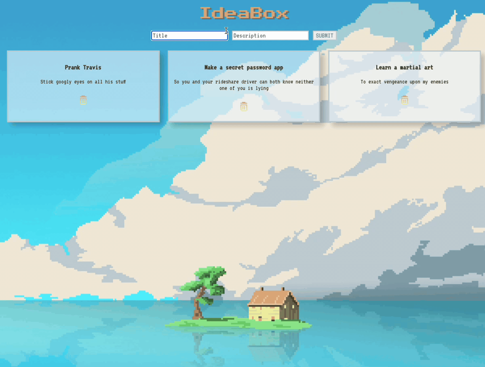

# Ideabox version 1
This application allows users jot down ideas on cards. Users can write the title of their ideas, and a short description and it will be rendered to the page.

## Technologies Used
React, create-react-app, CSS, HTML, JavaScript

## Contributors:
<a href="https://github.com/CaliHam">Calli Herrmann</a>

## Learning Goals:
As a student currently enrolled in Turing School of Software Engineering's front-end development program in Module 3, I actively engage in learning activities to enhance my skills. As part of our curriculum, I am working on this project from Turing's Module 3 curriculum: <a href="https://frontend.turing.edu/lessons/module-3/react-2-the-how.html">IdeaBox lesson</a> to reinforce my understanding of functional component-based React.

Through this project, my primary objectives are:

- Familiarize myself with the core concepts and principles of React, particularly functional component-based development.
- Demonstrate proficiency in using React's functional components to develop a practical application.
- Strengthen my understanding of React's modular and reusable component structure.
- Apply best practices for organizing and structuring a React project in accordance with industry standards.
- Develop a functional and visually appealing user interface using React's declarative approach and component-based architecture.

## Project Preview

## Set up
1. Fork or clone down this respository. 
2. In the terminal, open this app by running the command `cd <project folder name>`
3. Run the command `npm start` to start the server.
4. Open [http://localhost:3000](http://localhost:3000) to view it in your browser.
6. Use control C to stop the server.
